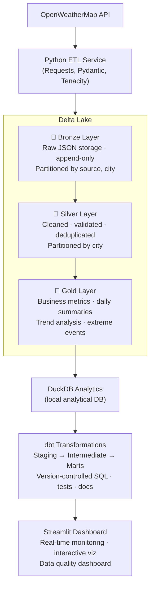

# 🌤️ Weather Data Engineering Platform

A  end-to-end weather data platform built with a modern data engineering stack, following Medallion Architecture .

[](https://python.org)
[](https://databricks.com)
[](https://getdbt.com)
[](https://streamlit.io)
[](https://docker.com)
[](https://github.com/features/actions)

## 📋 Table of Contents

- [Overview](#overview)
- [Architecture](#architecture)
- [Tech Stack](#tech-stack)
- [Features](#features)
- [Quick Start](#quick-start)
- [Project Structure](#project-structure)
- [Data Pipeline](#data-pipeline)
- [Monitoring & Observability](#monitoring--observability)
- [Deployment](#deployment)
- [Contributing](#contributing)
- [License](#license)

## 🎯 Overview

This project demonstrates a complete data engineering pipeline that:

1. **Ingests** real-time weather data from OpenWeatherMap API
2. **Stores** data in Delta Lake with Medallion Architecture
3. **Transforms** data using dbt and PySpark
4. **Analyzes** data with DuckDB for local analytics
5. **Visualizes** insights through an interactive Streamlit dashboard
6. **Automates** everything with GitHub Actions CI/CD

### Key Metrics

- **8+ Cities** monitored globally
- **Hourly** data ingestion
- **3-Layer** Medallion Architecture
- **Real-time** dashboard with 5+ interactive pages
- **100%** automated CI/CD pipeline

## 🏗️ Architecture



**Flow summary:** OpenWeatherMap → Python ETL → Delta Lake (Bronze → Silver → Gold) → DuckDB → dbt → Streamlit.

## 🛠️ Tech Stack

### Core Technologies
| Category | Technology | Version | Purpose |
|----------|------------|---------|---------|
| Language | Python | 3.12 | Primary language |
| Processing | PySpark | 3.5.0 | Data processing |
| Storage | Delta Lake | 3.0.0 | Storage format |
| Transformations | dbt | 1.7.0 | SQL transformations |
| Analytics | DuckDB | 0.10.0 | Local analytics |
| Dashboard | Streamlit | 1.29.0 | Visualization |

### Infrastructure
| Category | Technology | Purpose |
|----------|------------|---------|
| Cloud | Databricks | Data processing |
| CI/CD | GitHub Actions | Automation |
| Containerization | Docker | Containerization |
| IaC | Terraform | Infrastructure |

### Data Quality & Monitoring
| Category | Technology | Purpose |
|----------|------------|---------|
| Validation | Pydantic | Schema validation |
| Testing | pytest | Unit tests |
| Quality | dbt Tests | Model validation |
| Monitoring | Structured Logging | JSON logs |
| Alerting | Slack/Email | Notifications |

## ✨ Features

### Data Ingestion
- ✅ **Real-time API calls** to OpenWeatherMap
- ✅ **Retry logic** with exponential backoff (Tenacity)
- ✅ **Pydantic validation** for data quality
- ✅ **Structured logging** in JSON format
- ✅ **8+ cities** monitored globally

### Data Storage (Medallion Architecture)
- ✅ **Bronze Layer**: Raw JSON storage, append-only
- ✅ **Silver Layer**: Cleaned, validated, deduplicated data
- ✅ **Gold Layer**: Business metrics, aggregates, alerts

### Data Transformations
- ✅ **dbt models** with staging, intermediate, and marts
- ✅ **Incremental processing** for efficiency
- ✅ **Data quality tests** (unique, not_null, accepted_values)
- ✅ **Documentation** with dbt docs

### Analytics & Visualization
- ✅ **DuckDB** for local analytics
- ✅ **Streamlit dashboard** with 5+ pages
- ✅ **Plotly** interactive charts
- ✅ **Real-time KPIs** and metrics

### Automation & CI/CD
- ✅ **GitHub Actions** for automated pipeline
- ✅ **Hourly ingestion** schedule
- ✅ **dbt transformations** after ingestion
- ✅ **Quality checks** on PR and daily

### Monitoring & Alerting
- ✅ **Data freshness** monitoring
- ✅ **Quality scores** tracking
- ✅ **Slack/Email alerts** for issues
- ✅ **Metrics collection** and export

## 🚀 Quick Start

### Prerequisites
- Python 3.12+
- OpenWeatherMap API Key
- Databricks Account (Community Edition works)
- Docker (optional)

### 1. Clone the Repository
```bash
git clone  https://github.com/Shankar-behera/Weather-data-platform.git
cd weather-data-platform
```

### 2. Set Up Environment
```bash
# Copy environment template
cp .env.example .env

# Edit .env with your credentials
# OPENWEATHER_API_KEY=your_api_key
# DATABRICKS_HOST=your_databricks_host
# DATABRICKS_TOKEN=your_databricks_token
```

### 3. Install Dependencies
```bash
# Create virtual environment
python -m venv venv
source venv/bin/activate  # On Windows: venv\Scripts\activate

# Install packages
pip install -r requirements.txt
```

### 4. Run with Docker (Recommended)
```bash
docker-compose -f docker/docker-compose.yml up -d
```

### 5. Run Locally
```bash
# Run ingestion pipeline
python -m ingestion.main

# Run dbt transformations
cd dbt_weather
dbt build

# Start Streamlit dashboard
streamlit run streamlit_app/app.py
```

## 📁 Project Structure

```
weather-data-platform/
│
├── ingestion/                    # ETL Service
│   ├── config.py                 # Configuration management
│   ├── models.py                 # Pydantic data models
│   ├── service.py                # Weather API service
│   ├── databricks_client.py      # Databricks Delta Lake client
│   └── main.py                   # Entry point
│
├── databricks/                   # Databricks Artifacts
│   ├── notebooks/                # Databricks notebooks
│   │   ├── 01_ingest_weather_data.py
│   │   ├── 02_bronze_to_silver.py
│   │   └── 03_silver_to_gold.py
│   └── delta_tables/             # Table schemas
│       └── schema_definitions.sql
│
├── duckdb/                       # DuckDB Analytics
│   ├── analytics.py              # Analytics interface
│   ├── analytics.duckdb          # DuckDB database
│   └── queries.sql               # Analytical queries
│
├── dbt_weather/                  # dbt Transformations
│   ├── models/
│   │   ├── staging/              # Staging models
│   │   ├── intermediate/         # Intermediate models
│   │   └── marts/                # Mart models
│   ├── tests/                    # Data quality tests
│   ├── macros/                   # Custom macros
│   ├── seeds/                    # Seed data
│   ├── dbt_project.yml           # dbt configuration
│   └── profiles.yml              # dbt profiles
│
├── streamlit_app/                # Streamlit Dashboard
│   ├── app.py                    # Main dashboard
│   ├── pages/                    # Dashboard pages
│   │   ├── 01_overview.py
│   │   ├── 02_trends.py
│   │   ├── 03_city_explorer.py
│   │   └── 04_data_quality.py
│   └── utils/                    # Utility functions
│       └── data_loader.py
│
├── tests/                        # Test Suite
│   ├── unit/                     # Unit tests
│   ├── integration/              # Integration tests
│   └── conftest.py               # Test configuration
│
├── monitoring/                   # Monitoring & Observability
│   ├── alerts.py                 # Alert system
│   ├── metrics.py                # Metrics collection
│   ├── quality_checks.py         # Data quality checks
│   └── logs/                     # Log files
│
├── infrastructure/               # Infrastructure as Code
│   └── terraform/                # Terraform configurations
│
├── docker/                       # Docker Configuration
│   ├── Dockerfile.etl             # ETL container
│   ├── Dockerfile.dbt             # dbt container
│   ├── Dockerfile.streamlit       # Dashboard container
│   └── docker-compose.yml         # Compose configuration
│
├── docs/                         # Documentation
│   ├── architecture.md           # Architecture docs
│   ├── setup.md                  # Setup guide
│   └── api_reference.md          # API reference
│
├── .github/                      # GitHub Actions
│   └── workflows/
│       ├── ingest.yml             # Hourly ingestion
│       ├── dbt.yml                # dbt transformations
│       └── quality.yml            # Quality checks
│
├── .env.example                  # Environment variables template
├── .pre-commit-config.yaml       # Pre-commit hooks
├── requirements.txt              # Python dependencies
├── pyproject.toml                # Project configuration
└── README.md                     # This file
```

## 🔄 Data Pipeline

### Medallion Architecture

**Bronze Layer (Raw Data)**
- Purpose: Store raw JSON from API
- Strategy: Append-only, immutable
- Partition: `source`, `source_city`
- Retention: 30 days

**Silver Layer (Cleaned Data)**
- Purpose: Cleaned, validated data
- Strategy: Deduplicated, quality checked
- Partition: `city`
- Validations: Temperature range, humidity range, pressure range

**Gold Layer (Business Metrics)**
- Purpose: Business-ready aggregates
- Tables:
  - `weather_daily_summary`: Daily aggregates by city
  - `weather_trend_analysis`: Rolling window analytics
  - `extreme_weather_events`: Alert detection

### dbt Models

**Staging**
- `stg_weather`: Clean source data

**Intermediate**
- `int_weather_metrics`: Calculated metrics, rolling averages

**Marts**
- `mart_city_weather`: City-level analytics
- `mart_global_weather`: Global weather insights

## 📊 Monitoring & Observability

### Data Quality Metrics

| Metric | Threshold | Alert Level |
|--------|-----------|-------------|
| Data Freshness | > 4 hours | Warning |
| Data Freshness | > 24 hours | Critical |
| Quality Score | < 4.5/5 | Warning |
| Quality Score | < 4/5 | Critical |
| Missing Records | > 20% | Warning |
| Missing Records | > 50% | Critical |

### Logging
- **Format**: JSON structured logs
- **Levels**: DEBUG, INFO, WARNING, ERROR, CRITICAL
- **Rotation**: Daily log rotation
- **Retention**: 30 days

### Metrics Collected
- **Ingestion**: Records processed, API latency, success rate
- **Storage**: Table size, file count, record count
- **Quality**: Validation pass rate, completeness score
- **Performance**: Query duration, processing time

## 🚢 Deployment

### Production Deployment Steps

**1. Prepare Environment**
```bash
# Configure production environment
cp .env.example .env.prod
# Edit .env.prod with production credentials
```

**2. Build Docker Images**
```bash
docker build -f docker/Dockerfile.etl -t weather-etl:latest .
docker build -f docker/Dockerfile.dbt -t weather-dbt:latest .
docker build -f docker/Dockerfile.streamlit -t weather-dashboard:latest .
```

**3. Deploy with Terraform**
```bash
cd infrastructure/terraform
terraform init
terraform plan
terraform apply
```

**4. Run CI/CD Pipeline**
- Push to `main` branch triggers GitHub Actions
- Automated tests run
- Deployment to production

### Cost Optimization
- **Storage**: Delta Lake compaction, VACUUM
- **Compute**: Auto-scaling, spot instances
- **Data**: Partitioning, data retention policies
- **Monitoring**: CloudWatch, Datadog integration

